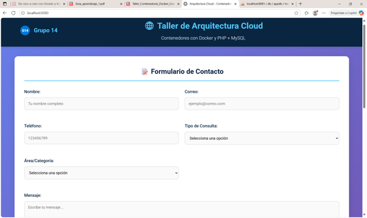
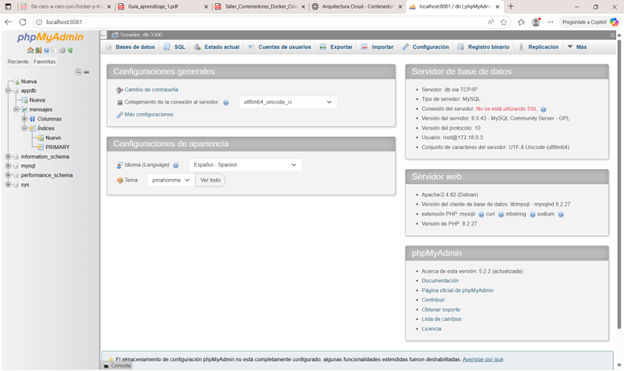

# 🐳 Taller Docker - Grupo 14

## 👥 Equipo y Roles
- Líder técnico
- **Camila Martínez López** - Desarrollo Backend - Documentador
- **Diana Paola Mopan Cabrera** - Desarrollo Frontend - Documentador
- **Jose David Arrieta Torres** - Base de Datos
- **Luis Alejandro Espinal Arango** - Configuración Docker
- Expositor

## 🎯 Objetivo del Ejercicio
Crear una aplicación web con PHP y MySQL usando contenedores Docker, implementando un formulario de contacto con validaciones y persistencia de datos.

## 📸 Capturas

### Formulario Completo

*Formulario con 6 campos y validaciones visuales*

### phpMyAdmin

*Administración de la base de datos en puerto 8081*

## 💻 Comandos Principales

```bash
#Apaga cualquier contenedor previo.
docker compose down -v

# Ejecución inicial
docker compose up -d --build

# Verificación de contenedores 
docker compose ps
#(phpMyAdmin no aparecía)

# Solución: Agregamos phpmyadmin al docker-compose.yml
# Luego reiniciamos todo
docker compose down -v
docker compose up -d --build

# Verificación final (todos los contenedores activos)
docker compose ps
```

## 💾 Almacenamiento de Datos
- ### Conexión PDO en db.php
    La clase PDO en creae una una instancia que representa la conexión con la base de datos, a la clase se le envían el parámetro de dsn con los datos necesarios para conectar a la base de datos como host, nombre de base de datos, usuario, contraseña e información del driver.

## 🌩️ REFLEXIÓN ¿Cómo se relaciona esto con la arquitectura Cloud?
El ejercicio permitió:
- **Dividir una aplicación grande** en partes pequeñas que funcionan juntas
- **Usar contenedores** que empaquetan cada parte de la aplicación  
- **Conectar servicios** que se pueden agregar o quitar según lo necesitemos
- **Mantener los datos** aunque reiniciemos los servicios

## 🗣️ Sustentación
### 1. Qué mejoras implementaron.
En cuanto al Backend:
   - Se agregó un nuevo microservicio de análisis de sentimientos para analizar la polaridad del campo 'mensaje' en el formulario
   - Se creó una red tipo bridge llamada app-network y todos los contenedores son parte de esa red.
En cuanto al FrontEnd:
   - Cambios en el diseño, paleta de colores, header, footer, botones, tabla, etc.
   - Se agregaron 6 campos al formulario
   - Validaciones en los campos.

    
### 2. Cómo se comunican los contenedores entre sí.
    
### 3. Cómo confirmaron la persistencia de datos.
### 4. Qué aprendieron sobre la modularidad y arquitectura cloud.


## 🤔 Preguntas para la reflexión final
1. ¿Qué diferencia hay entre un contenedor y una máquina virtual?
   
    La diferencia fundamental entre un contenedor y una máquina virtual (MV) se encuentra en la capa de virtualización. Un contenedor virtualiza la capa del sistema operativo, lo que lo hace mucho más ligero,         rápido y portátil; por ello, es ideal para arquitecturas de microservicios. En cambio, la máquina virtual virtualiza el hardware físico completo, proporcionando un entorno totalmente aislado, lo que la hace       más pesada y lenta, pero le otorga la máxima seguridad y una gran flexibilidad de sistema operativo.

2. ¿Qué pasaría si se elimina el contenedor de MySQL pero no el volumen?
   
    Los datos persistirían. Esto ocurre porque el contenedor solo contiene la aplicación de MySQL Server y sus archivos de ejecución. El volumen de Docker es el mecanismo de almacenamiento persistente; al no          eliminarlo, los archivos de la base de datos se conservan en el sistema de archivos del host, fuera del contenedor.
    Sin embargo, el servicio se detiene y desaparece, ya que el contenedor ya no existe. Por lo tanto, la base de datos no estará accesible a través de la red (puerto 3306) hasta que se cree un nuevo contenedor       que se conecte al volumen conservado.
   
3. ¿Qué rol cumple el archivo docker-compose.yml en la orquestación de
servicios?
 > - El archivo Docker compose se encarga de cargar los servicios y sus dependencias de forma centralizada para aplicaciones donde se utilice la estrategia de multi contenerización, esto significa  que cuando se está utilizando por ejemplo el servicio de frontend, backend y base de datos en contenedores distintos, docker compose se encarga de subir todos los servicios a través de un solo comando en lugar de subir cada contenedor manualmente.  El archivo docker compose es declarativo y se compone de objetos como servicios, volúmenes, variables de entorno, configuraciones de red. 

4. ¿Cómo se comunican los contenedores entre sí dentro de la red interna?

 > -   Por defecto, docker utiliza una red interna en la que solo puede ver su interfaz de red con una dirección IP, una IP de puerta de enlace, una tabla de enrutamiento y otros componentes de red. 
Docker utiliza driver de red en el que cada uno tiene un comportamiento distinto. 
Por defecto, docker utiliza el driver llamado bridge para crear una red interna aislada en el host y permite que los contenedores se hablen entre si al crearlos dentro del mismo rango de red. 
Para particularidad del ejercicio, se creó una red dentro del docker compose llamada app-network y de tipo bridge, y se le asignó a cada servicio esta red.


5. ¿Por qué es importante separar la aplicación web del motor de base de
datos?
    - **Seguridad**: Si se compromete la aplicación web, el atacante no tiene acceso directo a la base de datos.
    - **Escalabilidad**: Cada parte puede crecer independientemente.
    - **Mantenimiento**: Actualizar uno sin afectar al otro.
    - **Rendimiento**: Cada parte está optimizada para la tarea que le corresponde.
      
6. ¿Qué ventajas tiene Docker frente a un hosting tradicional?
    - **Consistencia**: la aplicación se comporte igual en desarrollo, testing y producción.
    - **Control**: Total libertad sobre versiones y configuraciones.
    - **Portabilidad**: Permite ejecutar la aplicación en cualquier sistema operativo sin modificaciones.
    - **Eficiencia**: Contenedores ligeros que comparten recursos eficientemente.
    - **Modernidad**: Docker permite adoptar arquitecturas modernas de microservicios y prácticas DevOps, altamente demandadas en el mercado tecnológico actual.
      
7. ¿Qué elementos del ejercicio serían equivalentes a servicios en AWS o
Azure?
    - **Base de datos**: SQL DataBase - S3  o Amazon RDS
    - **Token JWT**: Entra ID - AWS Identity
    - **Hosting**: Appservice - AWS App Runner
    
8. ¿Cómo se evidenció el trabajo colaborativo dentro del equipo?
    -Con la definicion de cada uno de los roles y las asginaciones, algunos compañeros no siguieron en el proceso y sin embargo a redistribución de tareas para cumplir con el taller.

